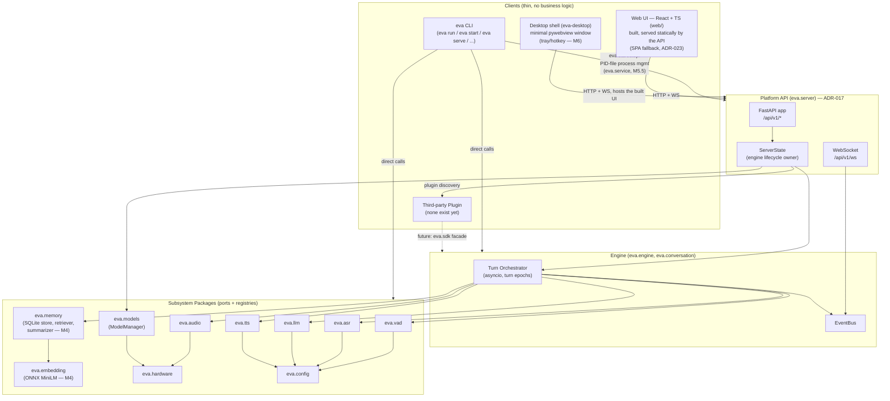
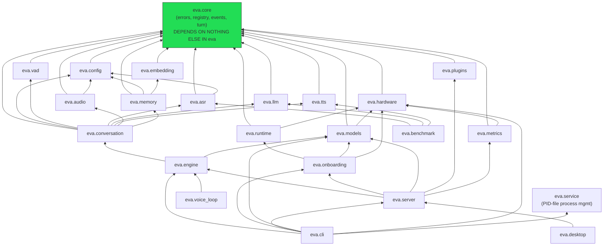
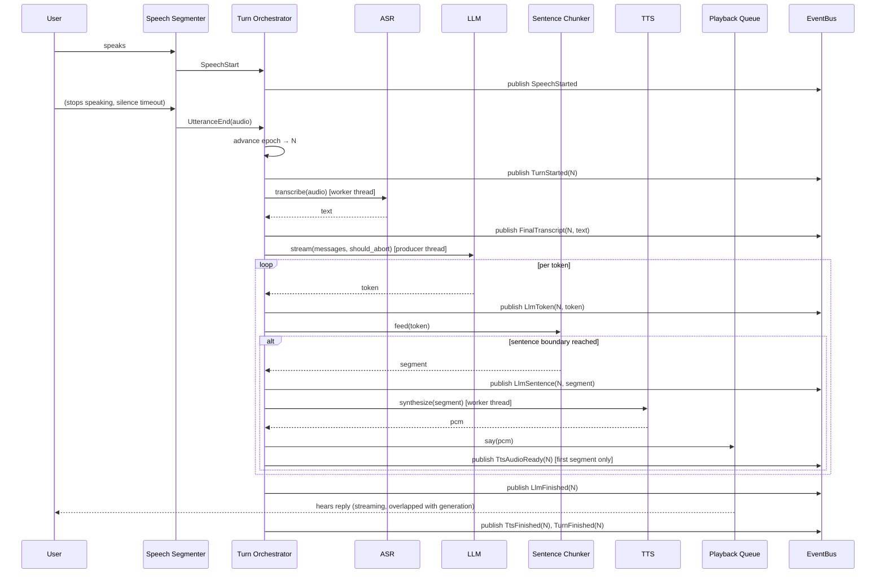
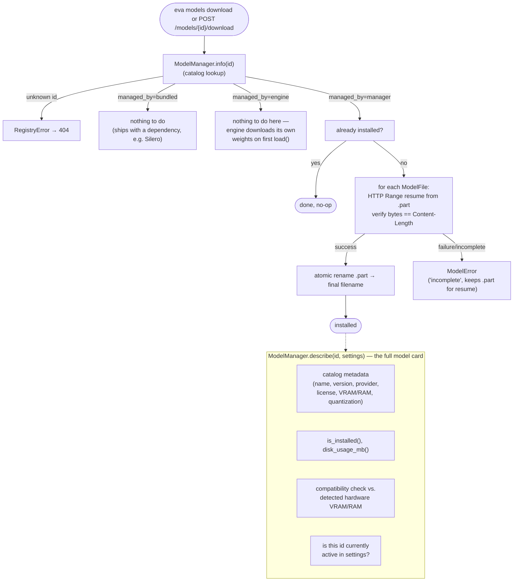
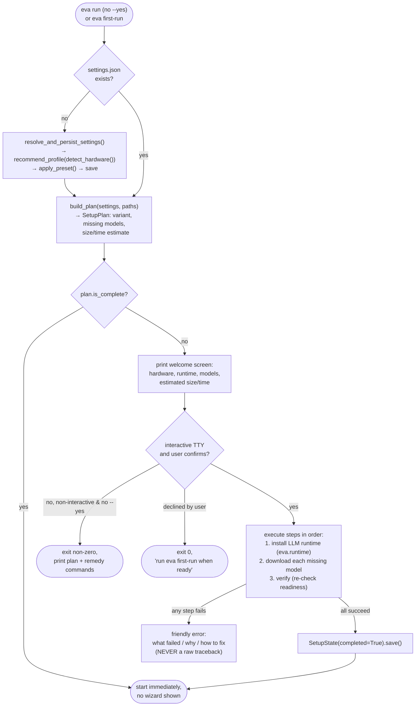
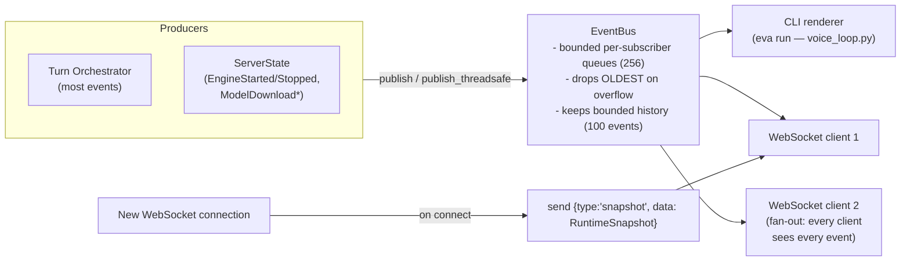
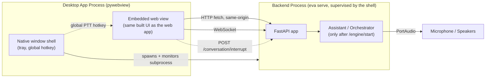
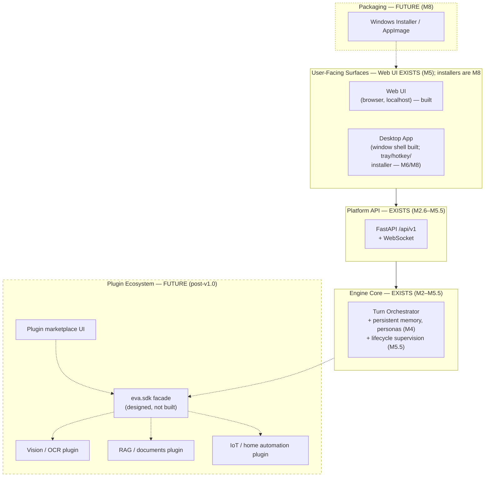

# Architecture Diagrams

Visual companions to `docs/ARCHITECTURE.md`.
These diagrams describe the system **as implemented through M5.5 (v0.5)**
unless a diagram is explicitly labeled "Future" — future diagrams describe
intended, not-yet-built shapes and should not be mistaken for current
behavior.

All diagrams are Mermaid; they render natively in GitHub, GitLab, and most
modern Markdown viewers.

## 1. Overall System Architecture



## 2. Module Dependency Graph



**Rule visualized:** nothing points sideways within the "one port +
registry" row (`VAD`/`ASR`/`LLM`/`TTS` never point at each other) — all
cross-subsystem coordination happens one layer up, in `eva.conversation`.

## 3. Voice / Audio Pipeline (steady state, no interruption)

```mermaid
flowchart LR
    Mic(["Microphone"]) --> Duplex["Duplex PortAudio Stream\n(one device clock)"]
    Speaker(["Speakers"]) --- Duplex
    Duplex -->|mic frame, 10ms| APM["WebRTC APM\n(AEC + NS + AGC)"]
    Duplex -.->|far-end reference, 10ms| APM
    APM -->|cleaned frame| Chunker["Frame Chunker\n(10ms → 512-sample)"]
    Chunker --> VADEngine["Silero VAD"]
    VADEngine -->|speech probability| Segmenter["Speech Segmenter\n(pure logic, pre-roll ring buffer)"]
    Segmenter -->|SpeechStart / UtteranceEnd / BargeIn / UtteranceProgress| Orchestrator["Turn Orchestrator"]

    Orchestrator -->|utterance audio| ASREngine["faster-whisper"]
    ASREngine -->|transcript| Orchestrator
    Orchestrator -->|messages| LLMEngine["llama.cpp\n(streaming tokens)"]
    LLMEngine -->|tokens| SentenceChunker["Sentence Chunker"]
    SentenceChunker -->|speakable segment| TTSEngine["Kokoro"]
    TTSEngine -->|PCM| PlaybackQueue["Playback Queue\n(fade-out on interrupt)"]
    PlaybackQueue --> Duplex
```



## 4. Conversation Sequence (one normal turn)



## 5. Barge-in Sequence (interruption)

```mermaid
sequenceDiagram
    participant User
    participant Segmenter as Speech Segmenter
    participant Orch as Turn Orchestrator
    participant LLM
    participant TTS
    participant Audio as Playback Queue
    participant Bus as EventBus

    Note over Orch,Audio: Turn epoch N is active; assistant is speaking
    User->>Segmenter: starts speaking over playback
    Segmenter->>Segmenter: accumulate speech during playback
    Note over Segmenter: barge_in_confirm_ms reached (default 200ms)
    Segmenter->>Orch: BargeIn(speech_ms)
    Orch->>Bus: publish BargeInDetected(epoch=N)

    Orch->>Orch: advance epoch → N+1 (ALL epoch-N work is now stale)
    Orch->>Audio: stop_speaking() → fade out ~40ms, flush queue
    Orch->>LLM: cancel (should_abort() now true for epoch N)
    Orch->>TTS: in-flight synthesis result discarded on stale epoch check
    Orch->>Bus: publish TurnCancelled(epoch=N, reason="barge-in")
    Orch->>Bus: publish StateChanged(state="listening")

    Note over Segmenter: pre-roll ring buffer already retained the\ninterrupting speech — it is NOT lost
    Segmenter->>Orch: UtteranceEnd(interrupting_audio) [epoch N+1]
    Orch->>Orch: start new turn normally (see diagram 4)
```

**Key invariant:** no artifact tagged with epoch N is ever spoken or acted on
after the epoch advances to N+1 — every producer/consumer checks staleness at
its next natural checkpoint (per LLM token, per TTS segment, per playback
poll). This is the single mechanism behind `"barge-in"`, `"superseded"`,
`"shutdown"`, and `"manual"` (API-triggered) cancellation — see
`TurnCancelled.reason`.

## 6. Engine Lifecycle

```mermaid
stateDiagram-v2
    [*] --> NotBuilt: eva serve starts\n(no engine yet — explicit start required)
    NotBuilt --> Building: POST /api/v1/engine/start\n(or `eva run`)
    Building --> Building: readiness check\n(eva.onboarding.check_readiness)
    Building --> NotBuilt: readiness failed\n→ 409 with problems list
    Building --> Loading: build_assistant()\n(resolve settings → model files → engines)
    Loading --> Loading: preload() — parallel (ADR-026)\nLLM strictly before ASR (GPU order,\nADR-015); TTS/embedding concurrent;\nComponentLoadStarted/Finished progress events
    Loading --> AudioStarting: start_audio()\n(opens duplex stream)
    AudioStarting --> Running: orchestrator.run() task scheduled
    Running --> Running: turns processed\n(see diagrams 4 & 5)
    Running --> Running: supervised recovery (ADR-026)\nASR/TTS crash → unload+reload in background\n(cooldown-guarded; one turn lost, not the engine)
    Running --> Stopping: POST /api/v1/engine/stop\n(or Ctrl+C in `eva run`, or `eva stop`)
    Stopping --> Stopping: ordered shutdown —\ncancel owned tasks (TaskManager),\norchestrator shutdown (TurnCancelled reason="shutdown"),\naudio stop, engines unloaded; exception-proof
    Stopping --> NotBuilt: assistant discarded
    NotBuilt --> [*]: process exits
```

## 7. Model Manager Workflow



## 8. First-Run Onboarding Flow



## 9. Plugin Architecture (current: backend only, no loading)

```mermaid
flowchart TB
    subgraph Installed["Installed Python Packages"]
        PkgA["some-plugin-package\n(hypothetical — none exist today)"]
    end

    PkgA -->|declares entry point| EntryPoints["importlib.metadata.entry_points\n(group='eva.plugins')"]
    EntryPoints --> Manager["PluginManager.discover()"]
    Manager -->|ep.load()| Factory["zero-arg callable"]
    Factory -->|returns| Manifest["PluginManifest\n(id, name, version, license,\ncontributes, permissions)"]
    Manifest --> State["PluginState\n(manifest, enabled, healthy, error)"]
    State --> API["GET /api/v1/plugins\nenable/disable/reload"]

    State -.->|"NOT YET IMPLEMENTED:\nactually loading contributions\ninto engine registries"| Registries["eva.vad / eva.asr / eva.llm / eva.tts\nregistries, eva.conversation\npersona/template registries"]
    Factory -.->|"NOT YET DESIGNED:\nnarrow eva.sdk facade\n(open design question, ADR-011)"| EngineInternals["Engine internals\n(orchestrator, ports)"]

    style Registries stroke-dasharray: 5 5
    style EngineInternals stroke-dasharray: 5 5
```

## 10. FastAPI / API Architecture

```mermaid
flowchart TB
    Uvicorn["uvicorn\n(eva serve)"] --> App["FastAPI app\n(eva.server.app.create_app)"]
    App --> CORS["CORSMiddleware\n(localhost/127.0.0.1 only)"]
    App --> ErrorHandlers["exception handlers\n(EvaError → status code,\nValidationError → 422)"]
    App --> StateInit["app.state.eva = ServerState(paths)"]

    App --> RouterSystem["/health, /system/hardware"]
    App --> RouterSettings["/settings\nGET/PUT/PATCH/validate/reset/schema"]
    App --> RouterModels["/models\nlist/get/download/remove/activate"]
    App --> RouterDiagnostics["/diagnostics"]
    App --> RouterPlugins["/plugins\nlist/get/enable/disable/reload"]
    App --> RouterEngine["/engine\nstatus/readiness/start/stop"]
    App --> RouterConversation["/conversation\nhistory/current/say/interrupt/\ncancel/clear/export/import"]
    App --> RouterMemory["/memory\nsearch/stats/turns/conversations/\ncontext-preview/export/import (M4)"]
    App --> RouterPersonas["/personas (M4)"]
    App --> RouterUsers["/users (M4)"]
    App --> RouterVoices["/voices + preview (M4)"]
    App --> RouterWS["/ws (WebSocket)"]
    App --> StaticUI["Static web UI mount at /\n(SPA fallback, ADR-023 —\nonly when web/dist exists)"]

    RouterSettings -->|StateDep| ServerState["ServerState\n(single engine-lifecycle owner)"]
    RouterModels -->|StateDep| ServerState
    RouterDiagnostics -->|StateDep| ServerState
    RouterPlugins -->|StateDep| ServerState
    RouterEngine -->|StateDep| ServerState
    RouterConversation -->|StateDep| ServerState
    RouterMemory -->|StateDep| ServerState
    RouterPersonas -->|StateDep| ServerState
    RouterUsers -->|StateDep| ServerState
    RouterVoices -->|StateDep| ServerState
    RouterWS --> ServerState

    ServerState --> ConfigService["eva.config.service\n(shared with CLI)"]
    ServerState --> ModelManager["eva.models.ModelManager\n(shared with CLI)"]
    ServerState --> PluginManagerRef["eva.plugins.PluginManager"]
    ServerState --> Assistant["eva.engine.Assistant\n(built only on /engine/start)"]
    ServerState --> EventBusRef["eva.core.events.EventBus"]

    App -.->|auto-generated| OpenAPI["/openapi.json, /docs (Swagger UI)"]
```



## 11. Event Bus Flow



## 12. Desktop ↔ Backend ↔ Engine Communication (partially built — M6 completes it)



**Status: partially built.** The backend, the web UI content, and a
minimal window shell (`eva-desktop`: in-process server + pywebview window)
shipped in M5. The tray icon, global push-to-talk hotkey, and
subprocess-supervision shape shown above are M6 scope (the supervision
primitives — PID file, spawn, health poll, terminate — already exist in
`eva.service`).

## 13. Future v1.0 Architecture (aspirational — not current state)


